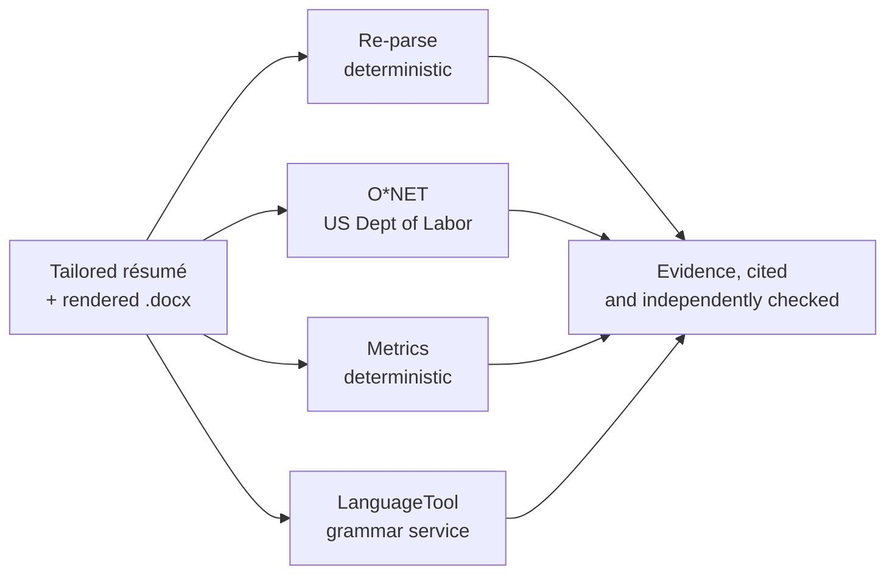
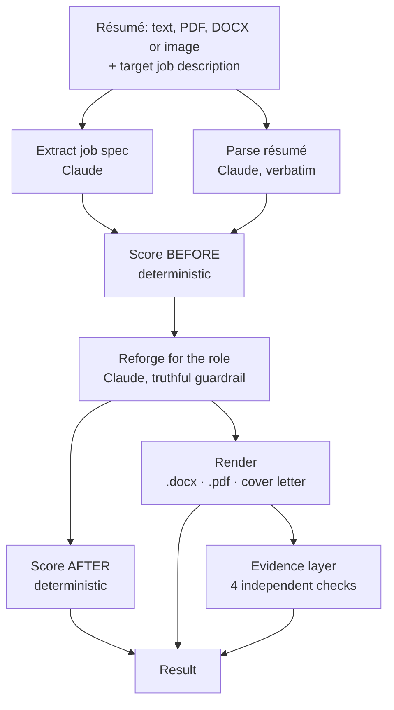

<p align="center">
  
</p>

<h1 align="center">Resumurai</h1>

<p align="center"><b>Reforge your résumé. Cut through the ATS.</b></p>

<p align="center">
  An <a href="https://www.okx.ai">OKX.AI</a> Agent Service Provider that scores a résumé against a
  specific job, reforges it for that exact role, and returns real ATS-safe files.<br/>
  Every result is <b>independently checked</b>, and it never fabricates experience.
</p>

<p align="center">
  <code>POST /x402/tailor</code> · 0.03 USDT per call · x402 on X Layer
</p>

---

## What it does

Give it a **résumé** (pasted text, or a PDF / DOCX / image upload) and a **target job description**. It returns:

- **An ATS score, before and after**, with a per-component breakdown you can audit
- **A rewritten, role-tailored résumé** as a real **ATS-safe `.docx`** and a styled **`.pdf`**
- **A tailored cover letter**
- **A gap analysis**: keywords it truthfully surfaced, and the honest gaps it could not close
- **Cited evidence** from independent sources (see below)

## Not just an LLM wrapper

Two things here are **not** the model's opinion:

**1. The ATS score is deterministic.** It is computed in code, not guessed by Claude, so it is reproducible and auditable:

| Component | Weight | What it measures |
| --- | --- | --- |
| Keyword coverage | 40% | Priority keywords for the role, present in the résumé (synonym-aware) |
| Hard requirements | 25% | Years of experience, degree, certifications actually met |
| Formatting | 20% | Single column, standard headings, no tables or graphics, parseable |
| Completeness | 15% | Summary, quantified achievements, relevant sections |

**2. Every result carries an evidence trail.** Four independent sources run in parallel on the finished résumé. Each is best effort: a slow or failing source is dropped rather than blocking the result.



| Source | What it proves | Type |
| --- | --- | --- |
| **Re-parse** | The generated `.docx` is run back through a parser to confirm the name, email, every role and every skill survive extraction. Proof it is machine readable, not a claim that it is. | Deterministic |
| **O*NET** | The US Department of Labor occupational standard. The role is matched to an occupation and the résumé is checked against its real technology list. The public-domain database ships with the app, so this works offline with no API key. | Authoritative, external |
| **Metrics** | Share of bullets with a concrete number, and share leading with a strong action verb. | Deterministic |
| **LanguageTool** | A real grammar and spelling service confirms the rewritten résumé is clean. | External service |

## Truthful tailoring

Resumurai may reword, reorder, reframe and surface experience the résumé already supports, and it may add a keyword only when there is an honest basis for it. It never invents employers, titles, dates, degrees, certifications or metrics. Anything it cannot honestly incorporate is reported as a gap instead.

## How it works

The design principle is **plan, then render**: Claude decides content and structure, and deterministic code produces the actual files. The model never emits file bytes or controls layout, which is why every résumé comes out single column, standard headed and cleanly parseable.



DOCX uploads are extracted to text server side with `mammoth`; PDFs and images are read by Claude's document and vision input.

## API

`POST /x402/tailor` is the paid agent endpoint (`GET` is also gated, for the OKX x402 probe). `POST /try` is the free path used by the website.

```jsonc
// request
{
  "resume": "…text…",                                  // or resumeFile
  "resumeFile": { "kind": "pdf|docx|image", "base64": "…", "mediaType": "…" },
  "jobDescription": "…the target job posting…",
  "options": { "includeCoverLetter": true }
}
```

```jsonc
// response (abridged)
{
  "role": "Senior Backend Engineer",
  "ats": { "scoreBefore": 74, "scoreAfter": 96, "before": {…}, "after": {…} },
  "gaps": { "injectedKeywords": [...], "notAddressable": [...] },
  "evidence": [
    { "label": "ATS parse check", "source": "Re-parse", "status": "pass",
      "detail": "Generated .docx re-parses to clean text: 2/2 roles and 13/13 skills recovered." }
  ],
  "positioningMemo": "…",
  "artifacts": [
    { "filename": "Alex-Chen-Resume.docx", "mimeType": "…", "base64": "…", "url": "/artifacts/…" }
  ]
}
```

Payment uses the `exact` scheme, **0.03 USDT** on **X Layer** (`eip155:196`), settled through the OKX Payment SDK. A circuit breaker rejects requests *before* the payment gate whenever the engine cannot serve, so a buyer is never charged for nothing.

## Develop

```bash
cp .env.example .env          # add ANTHROPIC_API_KEY; leave PAYMENTS_ENABLED=false for dev
npm install
npm run dev                   # API on :8792 (open mode, no payment)

npm --prefix web install      # the site, in another shell
npm --prefix web run dev
```

Checks:

```bash
npm test                          # deterministic scoring unit tests
npx tsx scripts/smoke-engine.ts   # live engine (needs ANTHROPIC_API_KEY)
npx tsx scripts/smoke-full.ts .   # engine + render, writes real .docx/.pdf
```

## Build and run

```bash
npm run build:all             # builds web/dist, then compiles the server
npm start                     # serves the API and the site on :8792
npm run gen:demo-cache        # regenerate the $0 demo cache for the site examples
```

The two website examples are precomputed (engine result *and* evidence), so clicking them is instant and costs nothing.

## Stack

TypeScript, Express, Claude (structured output via zod), `docx` and `pdfkit` for rendering, `mammoth` for DOCX input, the OKX x402 packages for payment, and React 19 with Vite SSG for the site.

---

<p align="center">
  <sub>Skills data from O*NET® (U.S. Department of Labor). Grammar checks by LanguageTool.</sub><br/>
  <sub><b>Resumurai sharpens your real experience. It never fabricates.</b></sub>
</p>
