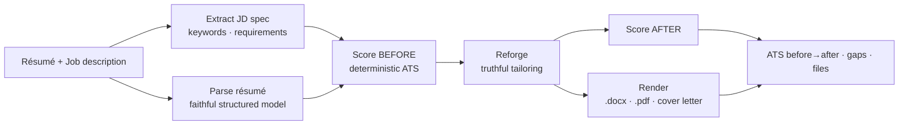

# Resumurai 🗡️

**Slice your résumé to cut through the ATS.**

Resumurai is an [OKX.AI](https://www.okx.ai) Agent Service Provider (ASP). Give it your
résumé and a target job description; it scores your résumé against the role's applicant
tracking system (ATS), reforges it for that exact role, and hands back a real **ATS-safe
`.docx` and `.pdf`** — plus a tailored cover letter and an honest gap analysis.

It sharpens your real experience. **It never fabricates.**

- **Paid endpoint (A2MCP):** `POST /x402/tailor` — pay-per-call over [x402](https://github.com/okx/payments), 0.03 USDT on X Layer.
- **Free web demo:** paste a résumé + job at the site and watch the ATS score get sharpened.

## How it works



The design principle is **plan → render**: the language model (Claude) decides *content and
structure* (a zod-validated tailoring spec); deterministic code renders the actual files. The
model never emits file bytes or controls layout, so every résumé comes out single-column,
standard-headed, and cleanly parseable — the format that actually passes an ATS.

### The ATS score

Deterministic and explainable — never guessed by the model:

| Component | Weight | What it measures |
|---|---|---|
| Keyword coverage | 40% | Priority keywords from the JD present in the résumé (with synonyms) |
| Hard requirements | 25% | Years of experience, degree, certifications actually met |
| Formatting | 20% | Single-column, standard headings, no tables/graphics — parseable |
| Completeness | 15% | Summary, quantified achievements, relevant sections |

### The honesty guardrail

Resumurai reframes and surfaces experience the résumé already supports, and uses the job's own
terminology where truthful. Any keyword or requirement it **can't** honestly incorporate is
reported as a gap — never invented. Fabricated résumés get people rejected or fired; this one
is built not to.

## Develop

```bash
cp .env.example .env          # add ANTHROPIC_API_KEY; leave PAYMENTS_ENABLED=false for dev
npm install
npm run dev                   # backend on :8792 (open mode, no payment)

# in another shell, the site (proxies /try etc. to :8792):
npm --prefix web install
npm --prefix web run dev
```

Offline checks:

```bash
npm test                      # deterministic scoring unit tests
npx tsx scripts/smoke-engine.ts   # live engine (needs ANTHROPIC_API_KEY)
npx tsx scripts/smoke-full.ts .   # engine + render -> writes real .docx/.pdf
```

## Build & run

```bash
npm run build:all             # builds web/dist then compiles the server
npm start                     # serves API + site on :8792
npm run gen:demo-cache        # regenerate the $0 demo cache for the site examples
```

## API

`POST /x402/tailor` (also `GET` for the OKX x402 probe) — x402-gated in production.

```jsonc
// request
{ "resume": "…text…", "jobDescription": "…text…",
  "resumeFile": { "kind": "pdf|image", "base64": "…", "mediaType": "application/pdf" },  // optional
  "options": { "includeCoverLetter": true } }

// response (abridged)
{ "role": "…", "ats": { "scoreBefore": 68, "scoreAfter": 91, "before": {…}, "after": {…} },
  "gaps": { "injectedKeywords": [...], "notAddressable": [...] },
  "positioningMemo": "…", "coverLetter": "…",
  "artifacts": [ { "filename": "…-Resume.docx", "mimeType": "…", "base64": "…", "url": "/artifacts/…" } ] }
```

Payment: `exact` scheme, **0.03 USDT** on **X Layer** (`eip155:196`), settled via the OKX Payment
SDK. Free web calls hit a demo cache for fixed examples and are rate-limited + daily-budgeted.

---

From the same dojo as [Scaminja 🥷](https://scaminja.app).
